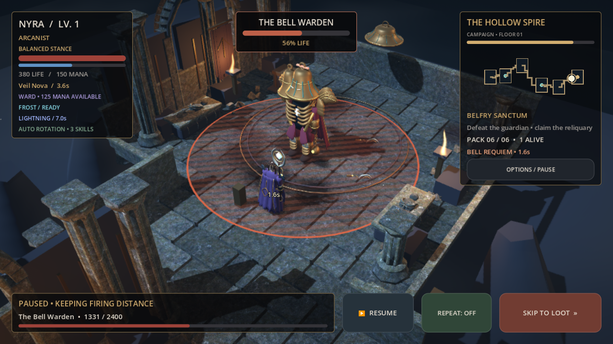

# Grafiküberarbeitung: Ashen Cathedral

Die Kritik an den einfachen Körperformen führte zu einer Überarbeitung der
tatsächlichen 3D-Assets. Spielfiguren bestehen jetzt aus elf originalen, in Blender
modellierten GLTF-Dateien. Die vollständige Modellierungsquelle liegt in `tools/art`.
Die Assets werden auch in Android-Exports verwendet.



## Figuren und Bosse

- **Vowkeeper:** gekrümmter Brustpanzer, überlappende Schulterplatten, Helmvisier,
  gewölbter Wappenschild, geformte Schwertklinge und bestickter Mantel.
- **Arcanist:** gefalteter langer Mantel, Gesicht und geflochtenes Haar, Schulter-
  Schmuck, Gürtelbuch und gebogener Kristallstab mit Zierfassung.
- **Ranger:** geformte Kapuze, durchgehend geschwungener Bogen mit Sehne, Köcher
  und einzelne Pfeile. Keine Reihe von Kästen als Bogen.
- **Bell Warden:** hohler Glockenkopf, bronzener Rippenpanzer um eine Seelenreliquie,
  ausladende Schulterlamellen, Glockenhammer und Kettenrauchgefäß.
- **Silt Abbot:** Schädelgesicht, abgetragene Kutte, gebogene Wurzelkrone und
  perlbesetzte Ranken.
- **Mourning Queen:** durchbrochene Dornenkrone, mehrere Schleierlagen und gebogene
  Knochenschwingen.
- **Cinder Sovereign:** geschwungene Hörner, Plattenrüstung, glühende Brustspalte
  und doppelte geschmiedete Hammerflügel.

Raider, Hexer, Bulwark und Elite verwenden ebenfalls neue Modelle. Säulen,
Spitzbögen, Grabmäler mit Liegefiguren, Glocken, Knochenbögen, Öfen und der
Pilgerbrunnen sind eigens modellierte Architekturmodule. Stein- und Metallkarten
stammen aus CC0-Quellen; [Quellen und Lizenz](../assets/materials/README.md).

## Darstellung und Prüfung

Die normale Spielkamera rückt etwas näher an Figuren heran und führt Bosskämpfe
sanft näher. Der Modus für reduzierte Bewegung behält eine feste Vergrößerung.
Gefahrenflächen behalten ihre echten Kollisionsmaße. Alle Bilder in
`play/assets` und `previews/play-beta` sind Godot-Renders der tatsächlichen
Spielszenen. Es wurden keine gemalten Figuren in Screenshots eingesetzt.

`previews/model-art` zeigt zusätzliche Nahansichten derselben Assets in einer
separaten Modell-Inspektionsszene. Die regionalen Grafik-Fixtures verwenden
zusätzliche Life-Punkte, um die Präsentation isoliert prüfen zu können; sie sind
keine Belege für die Spielbalance. Der Starter-Bosskampf oben verwendet den
tatsächlichen Starter-Build.

Die Geometrieprüfung verifiziert alle elf Charakterdateien, endliche Normalen,
passende Animationsgelenke, höchstens 40.000 Dreiecke pro Figur und höchstens neun
animierte Oberflächen plus Kontaktschatten. Wiederholte Figuren teilen Meshes und
Material. Architektur wird je Raum und Material instanziert; Stoff und Glieder
bleiben animierbar. Materialkarten verwenden Mipmaps und GPU-Komprimierung.

20 lokale Godot-Suiten bestehen insgesamt 1.450 Prüfungen. Animationen, vier
Regionen, Kameraaufbau, Spielstände und unveränderte Simulation wurden geprüft.
Der Android-Runtime-Workflow prüft zusätzlich AFK/Neustart und rendert die vier
Bossräume mit dem Android-Renderer. Das ersetzt keine Messung von Bildrate,
Temperatur und Speicher auf tatsächlichen ARM64-Telefonen.

```sh
blender -b -t 2 --python tools/art/build_characters.py
blender -b -t 2 --python tools/art/build_architecture.py
godot --headless --editor --import --quit
godot --headless --script tests/authored_art_smoke.gd
godot --script tests/model_art_preview.gd
```
