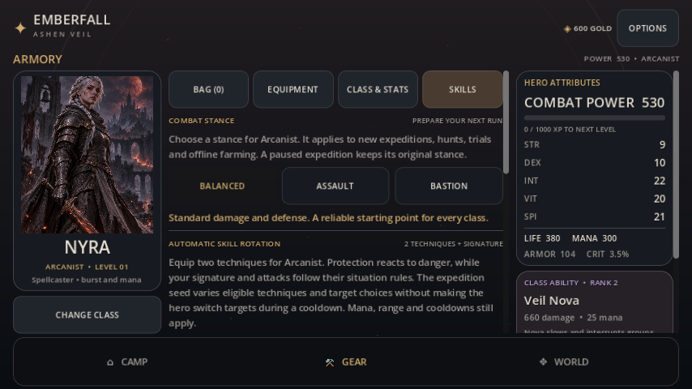
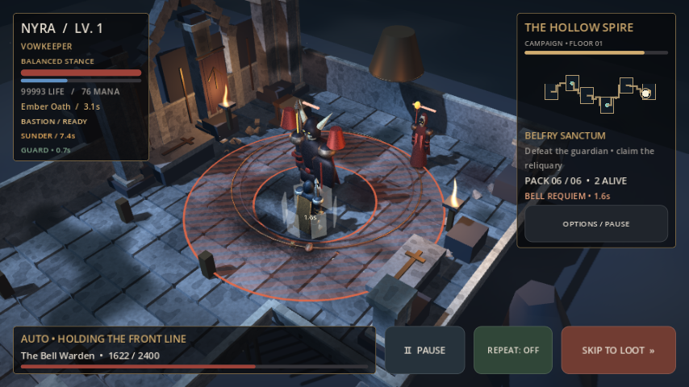

# Kampflesbarkeit und Kampfstile

Der Ausbau erhält Emberfalls stilisierte 3D-Dungeons und die automatische
AFK-Schleife. Der Schwerpunkt liegt auf lesbaren Gefahren, sichtbaren
Fernangriffen und einer zusätzlichen Build-Entscheidung vor der Expedition.

## Kampfstile

Unter **Gear → Skills → Combat Stance** wählt jede Klasse unabhängig einen Stil:

| Stil | Ausgeteilter Schaden | Eingehender Schaden | Einsatz |
| --- | --- | --- | --- |
| Balanced | unverändert | unverändert | Bestehende Balance, Standardauswahl |
| Assault | +18 % | +22 % | Schnellere Runs auf sicher beherrschten Etagen |
| Bastion | −12 % | −20 % | Mehr Überlebensspielraum, dafür längere Kämpfe |

Die Faktoren gelten für normale Angriffe, Klassenfähigkeiten und offensive
Techniken. Eingehender Schaden wird vor Rüstung, Guard und Mana Ward angepasst.
Heilung, Mana-Kosten, Beute und Abklingzeiten ändern sich durch den Stil nicht.
Ganzzahliger Schaden wird weiterhin nach den bestehenden Regeln gerundet.

Auswahlbuttons, die Beschreibung des gewählten Stils und die Anzeige im Kampf-HUD
machen die Entscheidung sichtbar. Tastaturfokus ist vorhanden. Die Auswahl wird
je Klasse gespeichert und in Backup-Codes übernommen. Unbekannte Profilwerte
fallen auf Balanced zurück; ungültige Checkpoints und Backups werden abgewiesen.

Neue Expeditionen, Hunts, Trials, Farm-Prognosen und Offline-Farmen erhalten
dieselben Kampfwerte. Der Stil gehört zum unveränderlichen Expeditionssnapshot.
Pausierte ältere Runs ohne Stil behalten exakt ihre bisherigen Schadensregeln.
Während eines Runs kann der Stil nicht geändert werden.

Assault und Bastion sind bewusst unterschiedliche Risiko-/Tempo-Entscheidungen.
Die Farm-Prognose sollte vor einem Etagenwechsel geprüft werden. Die zusätzlichen
Tests belegen die Startetage aller Klassen; sie ersetzen keine Balance-Erhebung
über sämtliche Endgame-Builds und Trial-Stufen.

## Grafik

- Alle Bodenwarnungen nutzen dieselben Kreis-, Ring- und Bahngeometrien wie die
  Trefferprüfung. Die sichtbare Fläche bleibt über den ganzen Countdown gleich
  groß. Auch normale Hexerwarnungen schrumpfen nicht mehr optisch.
- Ortsfeste Schraffuren und zunehmende Helligkeit zeigen Gefahrenflächen an.
  Ein Countdown bleibt auch bei abgeschalteten Schadenszahlen sichtbar.
- Pfeile und Zauberbolzen fliegen während des Ausholens zum Ziel. Techniken behalten
  ihre eigenen Effekte. Projektile sind Darstellung; die Simulation trifft weiterhin
  dieselben Schadensentscheidungen.
- Kritische Treffer erhalten eine wärmere Hervorhebung und einen kurzen begrenzten
  Kameraimpuls. **Reduced Motion** unterdrückt weiterhin Kameraimpulse.
- Die Zielmarkierung hebt sich deutlicher vom Steinboden ab.

Die Effekte nutzen die bestehende Kompatibilitätsdarstellung und erfordern keine
zusätzlichen Schatten oder dynamischen Lichter. Kurzlebige Effekte werden entfernt.
Es gibt keine neuen externen Grafikassets.

## Screenshots und Wiederholung

Die [Vorschauaufnahmen](previews/combat-craft/) enthalten die Stilauswahl und alle
vier echten Bosswarnungen bei **1280×720** und **854×480**. Die Bossfixtures benutzen
absichtlich erhöhtes Leben, um die Darstellung unabhängig von der Etagenbalance
zu erreichen. Das ist kein Fortschritts- oder Leistungsnachweis.





Die isolierte Vorschau lässt sich mit einem eigenen Datenverzeichnis wiederholen:

```bash
XDG_DATA_HOME=/tmp/emberfall-craft-preview godot --path . --audio-driver Dummy \
  tests/combat_craft_preview.tscn -- --capture-dir=/tmp/emberfall-craft-shots
```

Die Vorschau benötigt eine grafische Sitzung. Tests und Vorschau sind aus allen
bestehenden Android-Exportprofilen ausgeschlossen.

## Prüfungen

`python3 scripts/run_beta_checks.py` enthält jetzt zusätzlich
`combat_stances_smoke.gd`. Die neue Suite prüft Live-/Skip-/AFK-Gleichheit,
Checkpoint-Fortsetzung, alte Runs, Schadensfaktoren, Techniken, Auswahlbuttons,
Profil-Wiederherstellung und Backup-Validierung. Die Grafik-Suite prüft zusätzlich
die Countdown-Werte, unveränderte Gefahrenflächen und bewegte Projektile in allen
vier Gebieten. GitHub Actions führt beide Suiten aus.

Der vollständige Abschlusslauf besteht **18 Godot-Suiten mit 1.355 Checks und
0 Fehlern**, dazu Node-Syntax- und Serverlaufzeitprüfung.
[Prüfprotokoll](audit/2026-10-01/combat-craft.md).

Die lokale Prüfung verwendet Godot **4.7.2**, wie vom Projekt verlangt.
Grafische Aufnahmen stammen aus der OpenGL-Kompatibilitätsdarstellung mit Mesa
llvmpipe unter Linux. Ein physischer Android-Gerätetest und mobile
Leistungsmessungen sind noch ausstehend.
