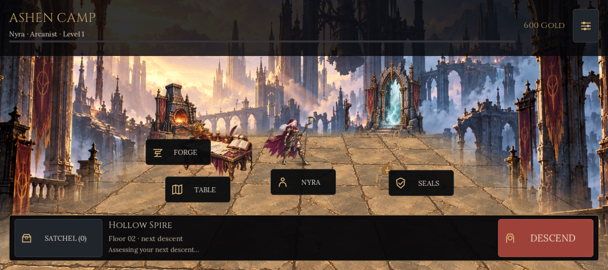

# Emberfall 0.40 · Umsetzung der freigegebenen Bildwelt

Die am 2. Oktober 2026 [freigegebene Spire-Illustration](design/approved-spire.png) ist als gemalte 2.5D-Welt im spielbaren Godot-Projekt umgesetzt. Nyra, Gegner und Wächter verwenden echte Zustände der Simulation; Lager, Vorbereitung und Kampf teilen Klasse und gespeicherte Ausrüstungsqualität. Die [Design-Dokumentation](../DESIGN.md) beschreibt die tatsächlich verwendeten Farben, Schriften, Abstände und Bedienelemente.

## Aktueller Umfang

- Drei Klassen derselben erwachsenen Nyra, vier Gegnerarten und vier regionale Wächter verwenden insgesamt 66 gemalte Posen. Kalibrierte Silhouettenpolygone wählen vollständige Posen direkt aus acht unveränderten transparenten PNG-Atlanten. Treffer nutzen zusätzlich Flash/Lean. Die Figuren sind keine voll geriggten 3D-Modelle.
- Spire, Archive, Ossuary und Citadel haben eigene gemalte Architektur und Atmosphäre. Räumlicher Boden, niedrige Mauern, Bewegung, Effekte und Warngeometrie bleiben Teil der echten 3D-Szene. Die verworfenen Charakter-GLBs liegen im Quellarchiv und sind aus Versand und QA ausgeschlossen.
- Schmiede, Expeditionstisch und Portal stehen an realen Lagerankern. Die Siegelsammlung zeigt nur gespeicherte Wächtertrophäen. Klasse und sechs Ausrüstungsplätze verändern gemeinsame Figurenakzente; nicht jeder Gegenstand besitzt ein eigenes Modell.
- Bis zu zwei der drei Schwüre lassen sich kombinieren. Beide Risiken gelten; Gold-/XP-Boni addieren sich, Beutezusätze werden einmal vergeben. Fähigkeiten, Klassenreliquien und regionale Sets haben echte Synergien. Wiederholungen, Neustart und Offline-Verarbeitung verwenden eingefrorene Vorbereitung; alte Checkpoints behalten ihre ursprünglichen Regeln.
- Alle vier Wächter haben drei Phasen mit eigenen Mustern, Phasennamen, Metallakzenten und Klangsignalen. Warnfläche, Schaden und Ausweichlogik nutzen dieselben Zonen. Die Kamera berücksichtigt den gesamten Umriss einschließlich Waffen und freier Bodenfläche.
- Cinzel und Lora sind lokal mit OFL-Lizenzen gebündelt. Native Schrift- und Touchgrößen, sichere Ränder, Large Text, Reduced Motion und Battery bleiben in den vorhandenen Hilfsfunktionen verankert.

## Galerie aus dem aktuellen Renderer

Alle 21 Bilder stammen aus tatsächlichen Godot-4.7.2-Szenen im GL-Compatibility-Renderer mit Software-Grafik. Die späten Wächter-Fixtures haben zusätzliches Leben (100000) und sind in Warnzuständen angehalten. Sie prüfen Bildwelt und Layout; sie belegen keinen normalen Kampfausgang und gehören nicht in Store-Werbung. Das breite Format ist ein Proxy für das Außendisplay, keine physische Pixel-Aufnahme. Nur die kompakte Reihe aktiviert die App-Einstellung Large Text; Android-Systemschrift und reale Insets sind hier nicht gemessen.

| Ansicht | Außendisplay-Aspekt · 1200 × 535 | Offen · 1040 × 1080 | Kompakt / Large Text · 854 × 480 |
|---|---|---|---|
| Lager | [Bild](../.impeccable/review/camp-1200x535.png) | [Bild](../.impeccable/review/camp-1040x1080.png) | [Bild](../.impeccable/review/camp-854x480.png) |
| Schwüre | [Bild](../.impeccable/review/oaths-1200x535.png) | [Bild](../.impeccable/review/oaths-1040x1080.png) | [Bild](../.impeccable/review/oaths-854x480.png) |
| Ausrüstung | [Bild](../.impeccable/review/gear-1200x535.png) | [Bild](../.impeccable/review/gear-1040x1080.png) | [Bild](../.impeccable/review/gear-854x480.png) |
| Bell Warden · Spire | [Bild](../.impeccable/review/boss-0-1200x535.png) | [Bild](../.impeccable/review/boss-0-1040x1080.png) | [Bild](../.impeccable/review/boss-0-854x480.png) |
| Silt Abbot · Archive | [Bild](../.impeccable/review/boss-1-1200x535.png) | [Bild](../.impeccable/review/boss-1-1040x1080.png) | [Bild](../.impeccable/review/boss-1-854x480.png) |
| Mourning Queen · Ossuary | [Bild](../.impeccable/review/boss-2-1200x535.png) | [Bild](../.impeccable/review/boss-2-1040x1080.png) | [Bild](../.impeccable/review/boss-2-854x480.png) |
| Cinder Sovereign · Citadel | [Bild](../.impeccable/review/boss-3-1200x535.png) | [Bild](../.impeccable/review/boss-3-1040x1080.png) | [Bild](../.impeccable/review/boss-3-854x480.png) |

## Review und Nachweise

Das frische vollständige [Finish Review](../.impeccable/review/finish-review-040.md) hatte genau eine notwendige Korrektur: zu schwache frühe Warnflächen auf warmem Spire-/Citadel-Boden. Die begrenzte Korrektur ergänzt dunklen Unterstrich, orangefarbenen Kern und stationäre Schraffur; Geometrie, Dauer und Kamera bleiben erhalten. Derselbe Reviewer bewertete diesen Punkt anschließend als **Resolved** und setzte im [Verdict Pass](../.impeccable/review/finish-verdict-040.md) **disposition: ship**. Die Originalberichte bleiben erhalten. Dies gilt für die abgeschlossene statische Prüfung und ihren einen Fix, nicht als neuer vollständiger Review oder Android-Freigabe.

| Ausgeführte Prüfung | Ergebnis |
|---|---|
| Godot-Baseline | 28 Suites · 2396 Checks · 0 Fehler |
| Begrenzte Grafikbestätigung | 6 Suites · 491 Checks · 0 Fehler; davon 228 Framing-Checks einschließlich Waffenbegrenzungen |
| Letzte Warnungs-/Help-Bestätigung | 3 Suites · 213 Checks · 0 Fehler |
| Atlas-Quellabbildung | 66 Posen · 0 ausgelassene sichtbare Pixel · 0 Überlappung mit Nachbarposen · 8 PNG-SHA256-Nachweise |

Die [Verifikationsdatei](audit/2026-10-02/redesign-verification.json) und [Atlasabbildung](audit/2026-10-02/pose-source-mapping.json) enthalten die maschinenlesbaren Nachweise. [Asset-Provenienz](design/ASSET_PROVENANCE.md) hält die genauen Prompts, PNG-Metadaten, unveränderten Pixelinhalte und Schriftlizenzen fest. Oath-Interaktionen und Offline-Parität beruhen auf Code-/Regressionstests, nicht auf den angehaltenen Galeriebildern.

## Gameplay und noch offene Messungen

Der [Gameplay-Clip](previews/success-loop/emberfall-gameplay-040.mp4) ist ein 16-sekündiger Export aus 384 tatsächlich gerenderten Frames bei 24 FPS mit normaler Startausrüstung und der ursprünglichen Spielmusik. Er zeigt Lager, Kampf, Wächterphase und verdiente erste Beute; redaktionelle Schnitte lassen Reise- und weitere Simulationsabschnitte aus. Aktuelle Store-Bilder werden separat aus normalen Spielzuständen erstellt; ihre Nachweise stehen in der Verifikationsdatei. Der Export ist kein Bildschirmmitschnitt eines physischen Smartphones und kein FPS-Benchmark.

Der [Spieltest- und Pixel-Probeplan](SUCCESS_PLAYTEST.md) ist für 12–20 Personen und ein isoliertes ARM64-Paket vorbereitet. Menschliche Ergebnisse, Pixel-Leistung, Wärme, Akkuverbrauch und Retention sind noch nicht erhoben. Die Ziele beziehungsweise Engine-Limits von 60 FPS Balanced und 30 FPS Battery sind keine gemessenen Zusagen. Offizielle Impeccable-Comp-Gates, ein numerischer Fidelity-Score, Hardwareprüfung und eine Bewegungsbewertung werden durch den manuellen Fallback-Review nicht ersetzt. Die aktuelle Android-CI muss den tatsächlich veröffentlichten Commit prüfen.
