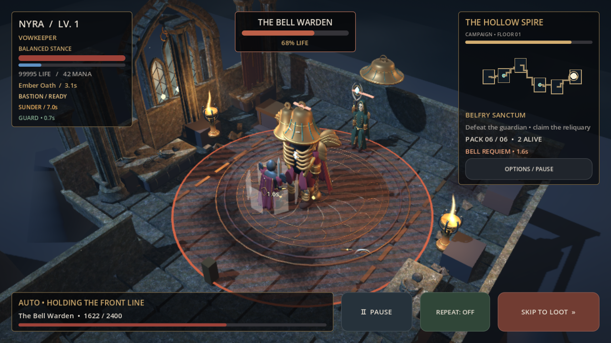

# Kathedralenräume: grafischer Ausbau der Beta 0.39

Diese Überarbeitung baut auf dem Abendstand vom 1. Oktober 2026 auf,
`fdc33d60`, im Branch `release/google-play-beta-039` / PR #3. `main` steht
weiter bei 0.38. Die Abendversion enthält elf neue GLTF-Figuren (drei Klassen,
vier Gegnerrollen, vier Bosse), acht Architekturmodule, PBR-Materialkarten,
Kampfhaltungen und die Solo/AFK-Beta mit schrittweiser Offline-Wiederaufnahme.

## Neue Spielgrafik

- Drei weitere originale Blender-Assets: dreiteiliges Spitzbogenfenster mit
  Bleiverglasung, geschnitzte Stein-/Bronze-Bodenintarsie und zeremonielle
  Feuerschale. Vollständige Modellierungsquelle: `tools/art/build_sanctuary.py`.
- Hintere Raumwände erhalten echte Maßwerkfenster und regionale Glasfarben:
  kaltes Blau, grünliches Türkis, Violett und Glutamber. Banner und Regale
  lassen mehr von den Fenstern sichtbar. Grabmäler ersetzen einfache Wandgitter.
- Sechs Kammern erhalten flache Bodenmedaillons und eingelassene Randbänder.
  Ihre Materialien leuchten nicht; aktive Angriffsflächen bleiben orange und
  behalten ihre echten Kollisionsmaße.
- Weiche Fensterlichter und dezente Lichtstrahlen modellieren Raumtiefe.
  Weniger gleichmäßiges Umgebungs-/Heldenlicht bewahrt Schatten und Silhouetten.
- Regionaler Mineralbesatz und feuchte Steinflächen ergänzen die PBR-Karten.
  Metall spiegelt etwas rauer. Die Wassernormalen werden korrekt von Welt-
  in Kamerakoordinaten umgerechnet, sodass Reflexionen der Wasserfläche folgen.

## Tatsächliche Spielansichten

Die Bilder sind unveränderte Godot-4.7.2-Spielrenders, GL Compatibility unter
Linux/Mesa llvmpipe, aufgenommen mit der bestehenden regionalen Boss-Fixture.
Diese Fixture verwendet zusätzliche Lebenspunkte zur Grafikprüfung. Sie ist
kein Balancebeleg und kein Android-Gerätetest. Alle drei Klassen und vier
Gebiete sind enthalten; beide Zielauflösungen wurden geprüft.

| Gebiet | 1280 × 720 | 854 × 480 |
| --- | --- | --- |
| Hollow Spire | [Bild](previews/sanctuary/boss-0-1280x720.png) | [Bild](previews/sanctuary/boss-0-854x480.png) |
| Sunken Archive | [Bild](previews/sanctuary/boss-1-1280x720.png) | [Bild](previews/sanctuary/boss-1-854x480.png) |
| Crow Ossuary | [Bild](previews/sanctuary/boss-2-1280x720.png) | [Bild](previews/sanctuary/boss-2-854x480.png) |
| Last Ember Citadel | [Bild](previews/sanctuary/boss-3-1280x720.png) | [Bild](previews/sanctuary/boss-3-854x480.png) |



## Technik und Prüfung

Mesh-/Materialinstanzen werden wiederverwendet und weiterhin pro Raum gebündelt.
Die Bündelung bewahrt jetzt den ursprünglichen Schattenstatus: flache Intarsien
und Schmutzflächen erzeugen keine unnötigen Schatten. Es kommen pro Dungeon
höchstens sechs schattenlose Fensterlichter und sechs einfache transparente
Lichtstrahlflächen hinzu. Im Battery-Modus sind beide deaktiviert. Reduzierte
Bewegung friert die Lichtstrahlmodulation ein. Es gibt keine zusätzlichen
Vollbild- oder Postprocessing-Pässe.

Die Zusatzmodelle bleiben jeweils unter 8.000 Dreiecken. Bestehende Figuren,
Animierungsachsen, Spielstandformat und Versionskennung bleiben erhalten.
Die Kampfsimulation, Beute und AFK-Berechnung wurden nicht geändert. Die
Grafiksuite prüft zusätzlich, dass Qualitätswechsel dieselben Kampfsnapshots
bewahren und flache Bodenmeshes auch nach dem Batching schattenlos bleiben.

Alle 20 lokalen Godot-Suiten bestehen mit insgesamt **1.465 Prüfungen**; die
betroffenen Grafik-, Modell- und Optionssuiten wurden nach der Korrektur eines
Lichtstrahl-Batchingfehlers gezielt wiederholt. Hinzu kommen fünf Python-
Releasechecks und die Server-JavaScript-Prüfungen.
[Maschinenlesbarer Nachweis](audit/2026-10-02/sanctuary-regression.json).
Die acht finalen GPU-Aufnahmen enthalten keine Shader-/Skriptfehler. Die
Android-CI-Ergebnisse für den neuen Commit stehen im PR. Software-
Rendering ist kein Leistungsnachweis für ein ARM64-Telefon; der vorhandene
Android-Runtime-Workflow rendert zusätzlich alle vier Regionen mit Android.

```sh
blender -b -t 2 --python tools/art/build_sanctuary.py
godot --headless --editor --import --quit
python3 scripts/run_beta_checks.py
godot --audio-driver Dummy tests/combat_craft_preview.tscn -- --capture-dir=/tmp/sanctuary
```
